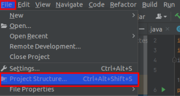

# GO d6

1.  **Utilitzant la línia de comandes, sense utilitzar un IDE de desenvolupament escriureu el programa en un fitxer de text que sigui el codi font, el codi font l’adjunteu dins el document.**

Primer crearem amb un touch a la carpeta quer vulguem l'arxiu "dado.go"
l'extensio és importantíssima, després entrem a l'arxiu i posem el codi.

```
 package main

 import (
 	"fmt"
 	"math/rand"
 	"sync"
 	"time"
 )

 var onlyOnce sync.Once

 // preparacio del dado   
 var dado = []int{1, 2, 3, 4, 5, 6}

 func rollDice() int {

 	onlyOnce.Do(func() {
 		rand.Seed(time.Now().UnixNano()) // ejecutar nomes una vegada
 	})

 	return dado[rand.Intn(len(dado))]
 }

 func main() {
 	dado1 := rollDice()
 	

 	fmt.Println("La teva cara del Dau es: ", dado1)
 	
 }
```
Guardem l’arxiu i obrim la terminal i al fer el build o el run em donava error 


El que he fet ha sigut instal·lar el "golang-go" i ara si l'he pogut executar creant l'executable amb build


2. **Descriviu com passar de codi font a codi objecte.**


Per poder passar de codi font a codi objecte el que farem sera la comanda “go build dado.go”


3. **Mostreu les extensions dels fitxers de codi font i codi objecte.**


4.  **Expliqueu els avantatges d’utilitzar un llenguatge compilat i els punts febles.**

Unes de les avantatges serien; La pròpia correcció dels errors en la compilació, ja que ens avisa abans de crear l'executable els erros que hi han. L'execució és molt més ràpida pel fet que no passa d'instrucció a instrucció executa tot el bloc una volta compilat.

Els punts febles serien; No podem corregir errors fins que no acabi de compilar, quan es revisa l'error cal tornar a compilar i la dificultat d'aprenentatge.


5. **Busqueu 3 IDEs de desenvolupament pel llenguatge.**


Els IDEs serien:

Visual studio code
https://code.visualstudio.com/


Netbeans
https://netbeans.apache.org/


Aquest és online

go.dev
https://go.dev/play/


# PYTHON d6

``` 
import random
 
numero1 = random.randint(0,10)

print ('El numero que has obtingut és ',numero1 
```


1. **Obrim un document nou on escrivim el codi font amb la funció per realitzar el programa del dau.**

Guardem el document amb extensió del llenguatge codi font que untilitzem, en aquest cas és llenguatge Python.El document serà d6_Python.py.


2. **Obrim el terminal de la carpeta on està el document amb el codi que volem executar.**

Al intentar executar l'arxiu ens dóna error i demana que instal·lem el Python.

Instal·lem l'extensió python

Un cop tenim l'extensió de Python instal·lada introduim el següent comandament : ``` python3 d6_Python.py``` i obtenim el resultat del programa.


3. **Descriviu com passar de codi font a codi objecte.**

per passar de codi font a codi objecte introduïm la comanda: ```pyhton3d6_Python.py```

4. **Mostreu les extensions dels fitxers de codi font i codi objecte.**


5. **Ventatges i desventatges llenguatge interpretat**

Pros
És independent de la màquina i sistema operatiuc, es poden executar en qualsevol plataforma.
Es pot modificar el codi mentre s'executa.
Ocupen menys lloc en la memòria
L'entorn de treball s'encarrega de que el hardware executi les instruccions.
Molt emprat en desenvolupament web i en electrònica.

Inconvenients

La alta portabilidad afecta a la velocita al executar el codi.
Difícils de depurar.
Requereix d'un software per interpretar les instruccions del procesador.
No todos los software es troben disponibles en totes les plataformes.


**JAVA d6**

Utilitzant la línia de comandes, sense utilitzar un IDE de desenvolupament
escriureu el programa en un fitxer de text que sigui el codi font, el codi font
l’adjunteu dins el document.


```
import java.util.ArrayList;
import java.util.List;
import java.util.Random;
import java.util.Scanner;

public class DauSisCares {

    public static void main(String arg[]) {
        List<Integer> numbers = new ArrayList<>(6);
        for (int i = 1; i < 7; i++) {
            numbers.add(i);
        }

// Instanciamos la clase Random
        Random random = new Random();

// Mientras queden cartas en el mazo (en la lista de numbers)
        while (numbers.size() > 1) {
            // Elegimos un índice al azar, entre 0 y el número de cartas que quedan por sacar
            int randomIndex = random.nextInt(numbers.size());

            // Damos la carta al jugador (sacamos el número por pantalla)
            System.out.println("Els resultat de la teva tirada, és " + numbers.get(randomIndex));

            // Y eliminamos la carta del mazo (la borramos de la lista)
            numbers.remove(randomIndex);
        }
    }
}


```

2. **Descriviu com passar de codi font a codi objecte.**

Per executar un programa Java, primer hem de compilar el programa. Llavor necessitem el openjdk-18 (Java Development Kit) per compilar i executar programes Java.

El primer que farem serà instal·lar el openjdk-18 ja que estem programa en la versió 18 sudo apt install openjdk-18-jre-headless


Molt bé ara passem al IntelIj i creem l'arxiu amb extensió .jar d'aquesta manera només tenim el Java Development Kit podrem executar el .jar en qualsevol sistema operatiu SO

Anem a file Project Structure




Artifacts  i seleccionem el nom del nostre projecte i li donem al ok


I carregem el projecte al transformador JAR


Una volta sap on està la ruta de l'arxiu anem a la pestanya Build i Build Artifacs


I seleccionem en Action Build


 I ja tenim el nostre programa preparat per a ser executat amb qualsevol SO


Finalment executem el programa amb la comanda java -jar PrimerProjecte.jar


3. **Mostreu les extensions dels fitxers de codi font i codi objecte.**


4.  **Expliqueu els avantatges d’utilitzar un llenguatge màquina virtual i els punts febles.**

Els avantatges serien la portabilitat entre diferents SO mantenint tot el codi igual que l'encapsulat, ja que tot allò necessari per al seu funcionament dins d'un entorn que és independent, tant del sistema operatiu des de la qual és creada, com amb altres màquines virtuals diferents del mateix servidor, com també un alt nivell de seguretat perquè una màquina virtual s'aïlla del mateix sistema operatiu en què està instal·lada, evitant qualsevol problema de seguretat, com pot ser malware. Evitant afecta el servidor, equip o altres màquines virtuals.

Però no tot són avantatges, també té inconvenients com per exemple la disminució del rendiment, ja que el rendiment serà inferior al del mateix equip o servidor físic on s'instal·la, Complexitat d'ús perquè on hi ha connexions amb xarxes diferents i s'utilitza una gran varietat de maquinari, pot arribar a ser tediós configurar una màquina. Al ser un llenguatge interpretat pot ser una mica més lent en l'ejecucio dels programes.


5. **Busqueu 3 IDEs de desenvolupament pel llenguatge.**


Els IDEs serien:

IntelIj

https://www.jetbrains.com/es-es/idea/


Netbeans

https://netbeans.apache.org/


Eclipse

https://www.eclipse.org/ide/


