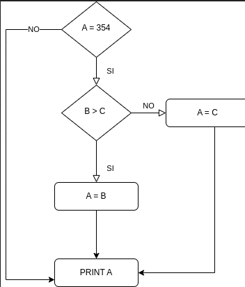
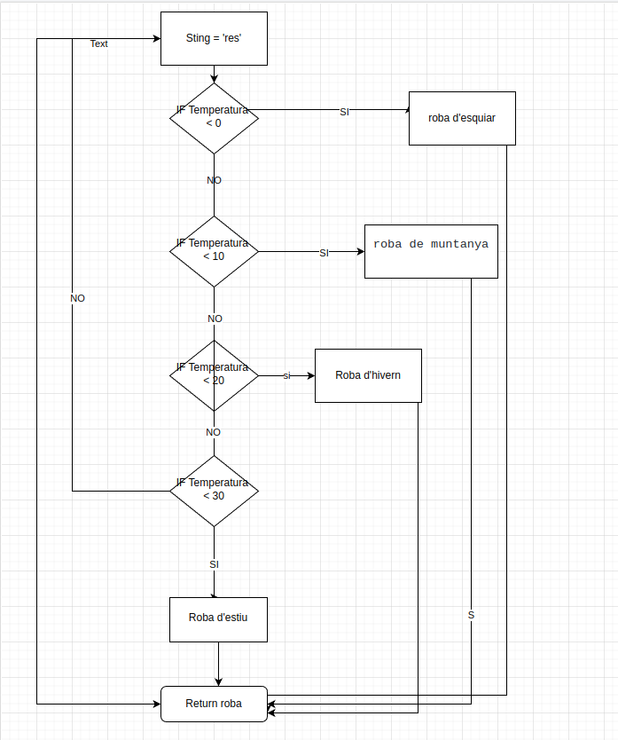

# Activitats: 

Per dibuixar els diagrames de flux podeu fer servir [draw.io](https://draw.io) o qualsevol altra eina online.

1. Calcula el CC de les següents figures:
  - 
  - 
  - 

  - **Resultat 1:**


**CC = 16 - 14 + 2 = 4**


  - **Resultat 2:**
  - **Resultat 3:**


2. Dibuixa el diagrama de flux representat per aquest codi i després calcula la seva CC:
  - 

  - **Diagrama:**



  - **Resultat CC:**
 
Farem laformula de  **Complexitat ciclomàtica = nombre de sentencies condicionals + 1** , ja que estic utilitzan el diagrama de flix vist a classe
Contem cuants de IFs hi han. Hi han  **2 tiangles  + 1 = 3**

**A = 354 ---> NO ---> PINT A<br>
B = 10 > C = 9  --SI-> A = C ---> A = 9 ---> PINT A<br>
B = 9 > C = 10 --NO-> A = B ---> B = 9 ---> PINT A**


3. Dibuixa el diagrama de flux representat per aquest codi i després calcula la seva CC:

```
public class proves {
    public static  String queEmPoso(int temperatura) {
        String roba = "res";
        if(temperatura<0){
           roba = "roba d'esquiar";
        }
        else if(temperatura<10){
           roba = "roba de muntanya";
        }
        else if(temperatura<20){
           roba = "roba d'hivern";
        }
        else if(temperatura<30){
           roba = "roba d'estiu";
        }
        return roba;
    }    
}
```

  - **Diagrama:**



  - **Resultat CC:**

Farem laformula de  **Complexitat ciclomàtica = nombre de sentencies condicionals + 1** , ja que estic utilitzan el diagrama de flix vist a classe
Contem cuants de IFs hi han. Hi han  **4 tiangles  + 1 = 5**

**temperatura = -10 ---> roba d'esquiar ---> Return roba<br>
temperatura = 8 ---> roba de muntanya ---> Return roba<br>
temperatura = 18 ---> roba d'hivern ---> Return roba<br>
temperatura = 28 ---> roba d'estiu ---> Return roba<br>
temperatura = 33 ---> res ---> Return roba**<br>
**Xavier no hem surt 


4. Dibuixa el diagrama de flux representat per aquest codi, calcula la seva CC i crea una prova per a cada camí posible:

```
    public static Boolean llumsEncesos(int hora) {
        Boolean llums = false;
        if(hora <= 8 || hora >= 20){
            llums = true;
        }
        return llums;
    }
```
  - **Diagrama:**
  - **Resultat CC:**
  - **Resultat proves camins:**

5. Investiga sobre les proves de caixa negra:

  - Què són?
  - Quina diferència principal tenen sobre les de caixa blanca?
